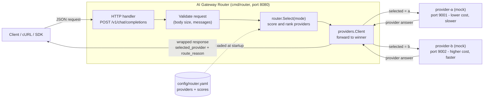
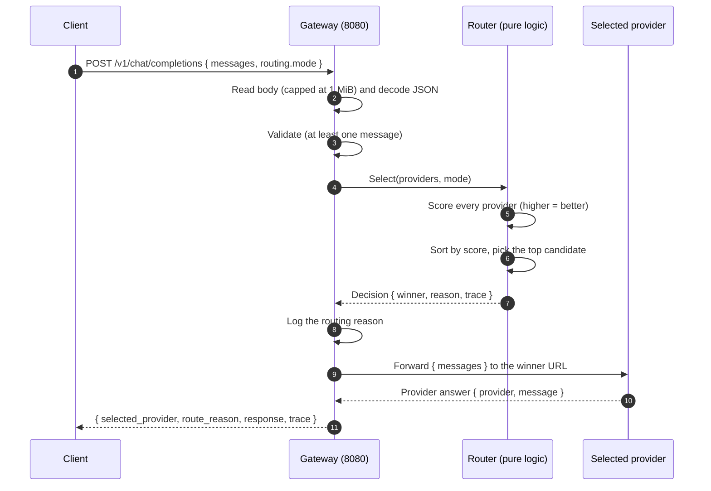
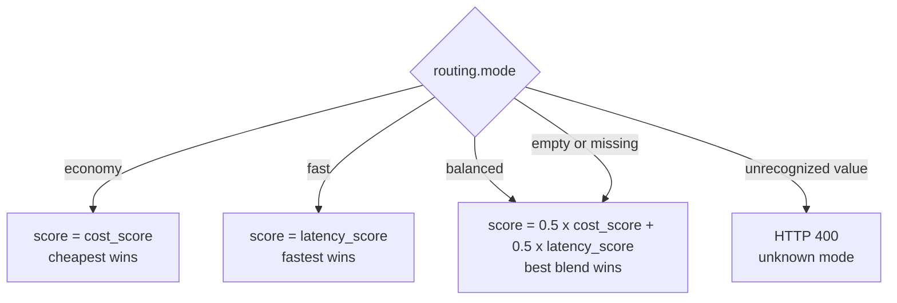

<div align="center">

# Adaptive Multi-Provider AI Gateway Router

**A lightweight Go gateway that accepts OpenAI-style chat requests and routes each one to the most suitable AI provider based on a configurable strategy.**

<br/>


</div>

---

## Table of contents

- [Overview](#overview)
- [Key capabilities](#key-capabilities)
- [Technology stack](#technology-stack)
- [Architecture](#architecture)
- [Request lifecycle](#request-lifecycle)
- [Routing logic](#routing-logic)
- [Project structure](#project-structure)
- [Prerequisites](#prerequisites)
- [Build and run](#build-and-run)
- [Try it out](#try-it-out)
- [API reference](#api-reference)
- [Configuration reference](#configuration-reference)
- [Relationship to the full design](#relationship-to-the-full-design)
- [Roadmap](#roadmap)
- [Troubleshooting](#troubleshooting)
- [Repository hygiene](#repository-hygiene)

---

## Overview

This service is an **AI gateway router**. It exposes a single, OpenAI-compatible endpoint
(`POST /v1/chat/completions`), and for every request it:

1. Validates the incoming payload.
2. Selects one downstream provider using a **routing strategy** (`economy`, `fast`, or `balanced`).
3. Forwards the request to the selected provider over HTTP.
4. Returns the provider's answer, **annotated with the routing decision and a full score trace**.

In version `0.1` the downstream providers are two local **mock** services, so the routing
behaviour can be exercised without API keys, network egress, or cost. The mock providers can
later be replaced with real provider adapters without changing the routing core.

```
                  +---------------------------------------------------+
   Client  ─POST─▶ |  AI Gateway Router  (this service, port 8080)     |
                  |  validate ─▶ score ─▶ select ─▶ forward            |
                  +-----------------------+---------------------------+
                              |
                  +-----------+-----------+
                  v                       v
          provider-a (9001)       provider-b (9002)
          lower cost, slower      higher cost, faster
```

---

## Key capabilities

| Capability | Description |
|------------|-------------|
| OpenAI-style contract | Accepts a standard `messages` array on `POST /v1/chat/completions`. |
| Strategy-based routing | Three selectable modes: `economy`, `fast`, `balanced`. |
| Transparent decisions | Every response includes `selected_provider`, `route_reason`, and a per-candidate `trace`. |
| Declarative providers | Providers and their cost/latency characteristics are defined in `config/router.yaml`. |
| Defensive request handling | Body size cap, JSON validation, empty-message rejection, unknown-mode rejection. |
| Resilient outbound calls | A single reused, context-aware HTTP client with a request timeout. |
| Operational endpoints | `GET /healthz` liveness probe and graceful shutdown on `SIGINT`/`SIGTERM`. |

---

## Technology stack

| Component | Technology | Role in this project |
|-----------|------------|----------------------|
|  | Go 1.22+ | Gateway, routing engine, provider client, mock providers. |
|  | `net/http` (stdlib) | HTTP server and client; method-aware routing patterns. |
|  | `gopkg.in/yaml.v3` | Parsing the provider configuration file. |
|  | `encoding/json` (stdlib) | Request/response serialization. |
|  | cURL | Manual endpoint testing. |
|  | Mermaid | Architecture and sequence diagrams in this document. |

The only third-party dependency is `gopkg.in/yaml.v3`. Everything else is the Go standard library.

---

## Architecture



Three independent processes run locally: the gateway and the two mock providers. Clients only
ever talk to the gateway, which fans out to whichever provider wins the routing decision.

---

## Request lifecycle



The handler in [cmd/router/main.go](cmd/router/main.go) follows these steps in order, top to bottom.

---

## Routing logic

All routing lives in [internal/router/router.go](internal/router/router.go) and performs no I/O,
which keeps it simple to reason about and test. The core principle: **in every mode the router
computes a single `score` where a higher value is better, then sorts the candidates descending.**
Only the way the score is computed differs between modes.

### Scoring fields

| Field | Meaning | Direction |
|-------|---------|-----------|
| `cost_score` | Normalized cost efficiency, range `0.0`–`1.0` | **Higher means cheaper** |
| `latency_ms` | Typical response time in milliseconds | **Lower means faster** |

> **Important convention:** `cost_score` is an efficiency score, not a raw price. A **higher**
> `cost_score` denotes a **cheaper** provider. This is why `provider-a = 0.9` is the lower-cost
> option and `provider-b = 0.5` is the higher-cost option. Normalizing every signal so that
> "higher is better" is what allows all strategies to share one ranking step.

### Strategy selection



`latency_ms` is converted into a comparable `latency_score` in `[0,1]` using a **latency budget**
of `1000 ms`:

```
latency_score = clamp(1 - latency_ms / 1000, 0, 1)     # higher means faster
```

### Worked example (using the sample configuration)

| Provider | `cost_score` | `latency_ms` | `latency_score` |
|----------|:---:|:---:|:---:|
| provider-a | 0.90 | 800 | `1 - 800/1000` = **0.20** |
| provider-b | 0.50 | 200 | `1 - 200/1000` = **0.80** |

Applying each strategy:

| Mode | provider-a score | provider-b score | Winner |
|------|:---:|:---:|:---:|
| `economy` | `0.90` | `0.50` | **provider-a** (lowest cost) |
| `fast` | `0.20` | `0.80` | **provider-b** (lowest latency) |
| `balanced` | `0.5*0.90 + 0.5*0.20 =` **0.55** | `0.5*0.50 + 0.5*0.80 =` **0.65** | **provider-b** |

In `balanced` mode provider-b wins because its speed advantage (0.80 vs 0.20) outweighs
provider-a's cost advantage (0.90 vs 0.50). Adjusting the weights (`costWeight`, `latencyWeight`)
or the providers' YAML values changes the outcome. These exact numbers appear in the `trace`
field of every response.

---

## Project structure

```
.
├── cmd/router/main.go            Gateway HTTP server (entry point)
├── internal/
│   ├── config/config.go          Load and validate router.yaml
│   ├── router/router.go          Scoring and provider selection (routing core)
│   └── providers/client.go       Reusable HTTP client for calling providers
├── mocks/
│   ├── provider-a/main.go        Mock provider on port 9001 (lower cost, slower)
│   └── provider-b/main.go        Mock provider on port 9002 (higher cost, faster)
├── config/router.yaml            Provider definitions and scores
├── go.mod / go.sum               Go module and dependency lock
├── .gitignore                    Excludes .claude/, secrets, build artifacts
└── README.md                     This document
```

| File | Responsibility | Rationale |
|------|----------------|-----------|
| [cmd/router/main.go](cmd/router/main.go) | Route wiring, server lifecycle, `POST /v1/chat/completions`, `GET /healthz`, graceful shutdown. | Thin HTTP/glue layer. |
| [internal/config/config.go](internal/config/config.go) | Parse YAML into typed structs and validate (unique IDs, in-range scores). | Configuration is data, kept separate from logic. |
| [internal/router/router.go](internal/router/router.go) | Score providers per mode, rank, and explain. No I/O. | Pure functions are easy to test and extend. |
| [internal/providers/client.go](internal/providers/client.go) | One reused, context-aware `*http.Client` with timeout and size caps. | Centralizes all outbound calls. |
| [mocks/provider-a](mocks/provider-a/main.go), [mocks/provider-b](mocks/provider-b/main.go) | Return canned JSON plus `/healthz`. | Exercise routing without keys or cost. |
| [config/router.yaml](config/router.yaml) | Declare providers, URLs, `cost_score`, `latency_ms`. | Change providers without recompiling. |

---

## Prerequisites

- **Go 1.22 or newer** (developed and tested on Go 1.26). Verify with `go version`.
- **cURL** for testing (preinstalled on macOS and most Linux distributions).
- A one-time dependency fetch (requires internet access once):

```bash
go mod tidy
```

This downloads `gopkg.in/yaml.v3` and writes `go.sum`. After it completes the project builds offline.

---

## Build and run

The system consists of three processes. Open three terminals at the project root.

**Terminal 1 — mock provider A (port 9001, lower cost, slower)**

```bash
go run ./mocks/provider-a
```

**Terminal 2 — mock provider B (port 9002, higher cost, faster)**

```bash
go run ./mocks/provider-b
```

**Terminal 3 — the gateway (port 8080)**

```bash
go run ./cmd/router
```

On startup the gateway prints the providers it loaded:

```
loaded 2 provider(s) from config/router.yaml
   provider-a   url=http://localhost:9001  cost_score=0.90  latency=800ms
   provider-b   url=http://localhost:9002  cost_score=0.50  latency=200ms
gateway listening on :8080
```

To run compiled binaries instead, build them into the git-ignored `bin/` directory:

```bash
go build -o bin/provider-a ./mocks/provider-a
go build -o bin/provider-b ./mocks/provider-b
go build -o bin/router     ./cmd/router
```

---

## Try it out

Run these from a fourth terminal while the three services are running.

**Health check**

```bash
curl -s http://localhost:8080/healthz
# {"status":"ok"}
```

**economy** (expected winner: `provider-a`)

```bash
curl -s -X POST http://localhost:8080/v1/chat/completions \
  -H 'Content-Type: application/json' \
  -d '{
        "messages": [{ "role": "user", "content": "Explain middleware in simple words." }],
        "routing": { "mode": "economy" }
      }'
```

**fast** (expected winner: `provider-b`)

```bash
curl -s -X POST http://localhost:8080/v1/chat/completions \
  -H 'Content-Type: application/json' \
  -d '{
        "messages": [{ "role": "user", "content": "Explain middleware in simple words." }],
        "routing": { "mode": "fast" }
      }'
```

**balanced** (expected winner: `provider-b`; also the default when `routing` is omitted)

```bash
curl -s -X POST http://localhost:8080/v1/chat/completions \
  -H 'Content-Type: application/json' \
  -d '{
        "messages": [{ "role": "user", "content": "Explain middleware in simple words." }],
        "routing": { "mode": "balanced" }
      }'
```

### Sample response (mode = economy)

```json
{
  "selected_provider": "provider-a",
  "mode": "economy",
  "route_reason": "economy mode -> chose provider-a: highest cost_score 0.90 (cheapest)",
  "response": {
    "provider": "provider-a",
    "message": "Mock AI response from provider-a"
  },
  "trace": [
    { "id": "provider-a", "cost_score": 0.9, "latency_ms": 800, "latency_score": 0.2, "score": 0.9 },
    { "id": "provider-b", "cost_score": 0.5, "latency_ms": 200, "latency_score": 0.8, "score": 0.5 }
  ]
}
```

The gateway terminal logs the same decision:

```
economy mode -> chose provider-a: highest cost_score 0.90 (cheapest)
provider "provider-a" responded
```

### Error handling

```bash
# Empty messages -> HTTP 400
curl -s -X POST http://localhost:8080/v1/chat/completions \
  -H 'Content-Type: application/json' -d '{"messages":[]}'
# {"error":"messages must contain at least one item"}

# Unknown mode -> HTTP 400 with the valid options
curl -s -X POST http://localhost:8080/v1/chat/completions \
  -H 'Content-Type: application/json' \
  -d '{"messages":[{"role":"user","content":"hi"}],"routing":{"mode":"turbo"}}'
# {"error":"unknown routing mode \"turbo\" (valid: economy, fast, balanced)"}
```

---

## API reference

### POST /v1/chat/completions

**Request body**

| Field | Type | Required | Notes |
|-------|------|:---:|-------|
| `messages` | array | Yes | At least one item; each `{ "role": string, "content": string }`. |
| `routing.mode` | string | No | `economy`, `fast`, or `balanced`. Empty or missing defaults to `balanced`. |

**Response body**

| Field | Type | Description |
|-------|------|-------------|
| `selected_provider` | string | ID of the provider chosen. |
| `mode` | string | The mode actually used (after defaulting). |
| `route_reason` | string | Human-readable explanation of the choice. |
| `response` | object | The provider's answer: `{ provider, message }`. |
| `trace` | array | Per-candidate scores showing how the decision was made. |

**Status codes**

| Code | Meaning |
|------|---------|
| `200` | Success. |
| `400` | Invalid JSON, empty `messages`, or unknown `routing.mode`. |
| `502` | The selected provider failed or was unreachable. |

### GET /healthz

Liveness probe. Returns `{"status":"ok"}`.

---

## Configuration reference

[config/router.yaml](config/router.yaml) is the single source of truth for providers.

```yaml
providers:
  - id: provider-a              # unique identifier
    url: http://localhost:9001  # base URL; gateway POSTs to <url>/v1/chat/completions
    cost_score: 0.9             # 0.0-1.0, higher means cheaper
    latency_ms: 800             # typical latency, lower means faster
  - id: provider-b
    url: http://localhost:9002
    cost_score: 0.5
    latency_ms: 200
```

**Runtime overrides** (useful for alternate configs or ports):

```bash
ROUTER_CONFIG=/path/to/other.yaml ROUTER_ADDR=:9999 go run ./cmd/router
# or
go run ./cmd/router -config ./config/router.yaml -addr :8080
```

Mock providers accept an `-addr` flag as well: `go run ./mocks/provider-a -addr :9101`.

**Tuning balanced mode:** edit the constants at the top of
[internal/router/router.go](internal/router/router.go) — `costWeight`, `latencyWeight`,
and `latencyBudget`.

---

## Relationship to the full design

This version implements the smallest runnable core of the broader gateway design. That design
defines a richer composite routing score:

```
score = w_health*H + w_latency*L + w_cost*C + w_quota*Q + w_quality*G
      + w_stickiness*S + w_retry*R + w_jitter*J - w_error*E - w_cooldown*D
```

Version `0.1` implements the **cost (C)** and **latency (L)** terms, exposed through strategy
presets. The shape is identical to the full model: normalize each signal so higher is better,
apply weights, sum, and sort. Additional signals (health, quota, retries, cooldowns) can be
added inside the existing `router.Select` seam, which is exactly why the routing logic is kept
isolated and free of I/O.

---

## Roadmap

The following items from the full design are intentionally excluded from version `0.1` and are
planned for later versions:

| Area | Planned addition |
|------|------------------|
| State and caching | Redis for quotas, cooldowns, idempotency, and exact-response cache. |
| Resilience | Retries with backoff and cross-provider failover. |
| Safety | Guardrails and PII moderation on requests and responses. |
| Observability | Prometheus metrics and Grafana dashboards. |
| ML helpers | Python FastAPI sidecar for semantic routing and token counting. |
| Packaging | Docker and Docker Compose for local orchestration. |
| Gateway integration | WSO2 custom-policy packaging. |

---

## Troubleshooting

| Symptom | Likely cause | Resolution |
|---------|--------------|------------|
| `502 provider "provider-x" failed` | A mock provider is not running. | Start `go run ./mocks/provider-a` and `./mocks/provider-b`. |
| `config error: ... read config` | Wrong working directory. | Run from the project root, or set `ROUTER_CONFIG`. |
| `address already in use` | Port 8080, 9001, or 9002 is taken. | Change it with the `-addr` flag. |
| `go: cannot find module` | Dependency not fetched. | Run `go mod tidy` once with internet access. |

---

## Repository hygiene

The included [.gitignore](.gitignore) keeps local assistant files and secrets out of version
control — in particular `.claude/`, along with `.env`, `*.secret`, and build artifacts.

```bash
git init
git add .
git status        # confirm .claude/ and secrets are not listed
git commit -m "v0.1: adaptive multi-provider AI gateway router"
```
